# Furniture House Sofia
Angular project defense.

The project is based on a furniture web-shop and has the following functionalities:

If the user is not logged in, they can go to:
 - Home
 - Products and New Collection (without the "Add to Cart" functionality)
 - Products and New Collection Details
 - Login / Register

The logged in user can:
 - Add products to cart
 - See items in cart
 - Make an order
 - Make a product request, delete a product request, edit a product request

Here is what the project's interface looks like:

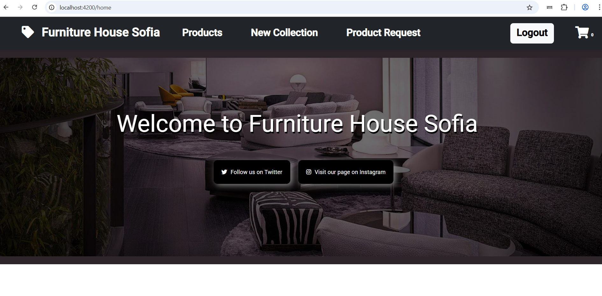

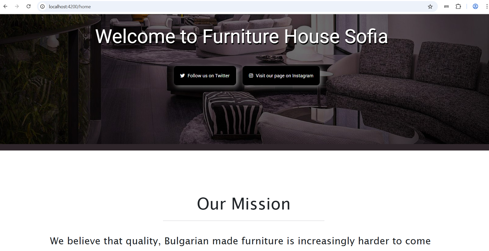

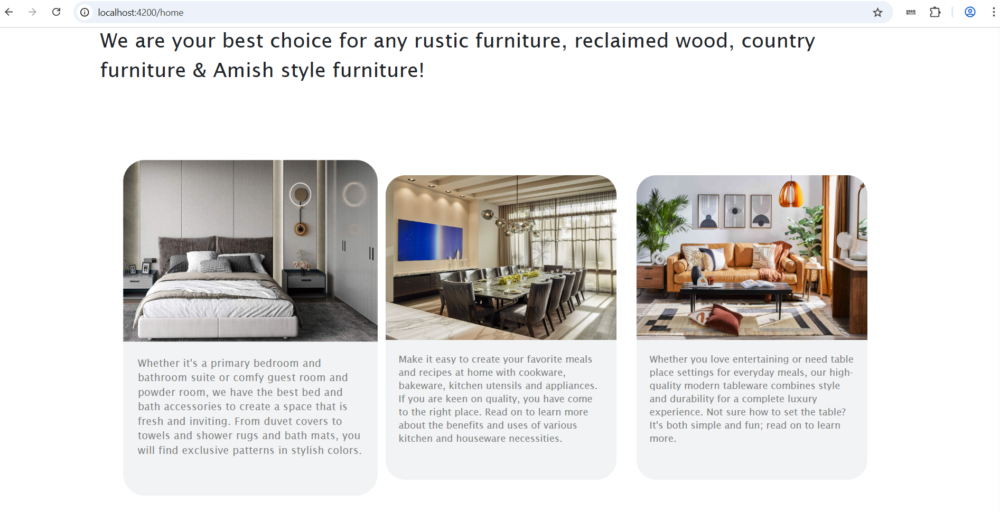

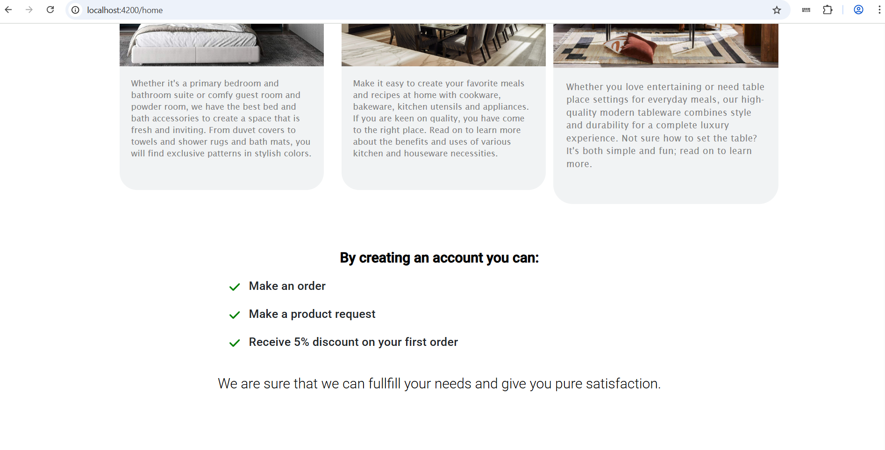

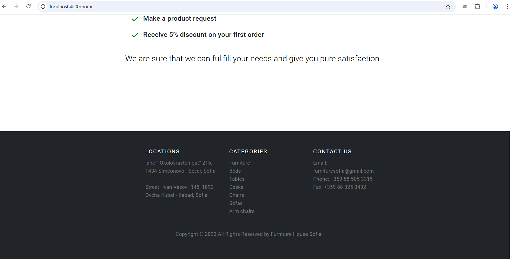

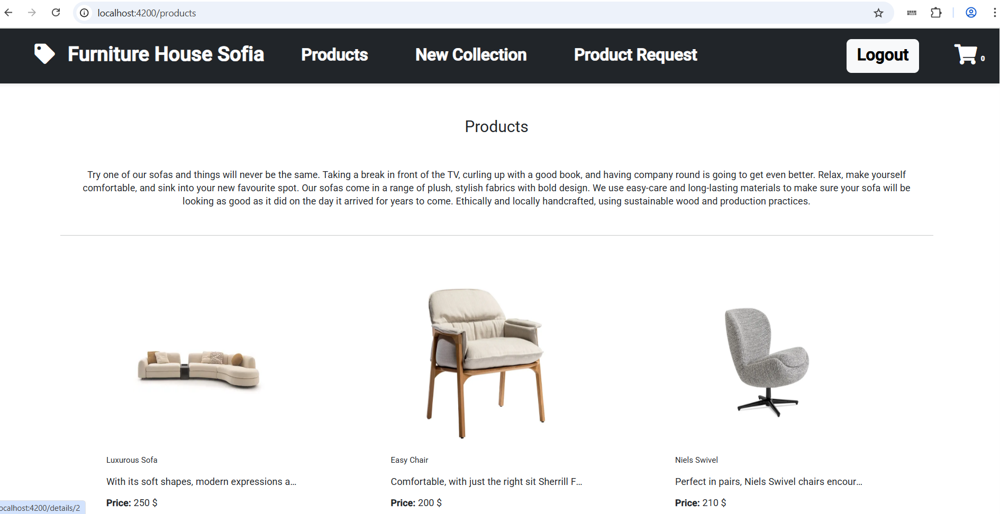

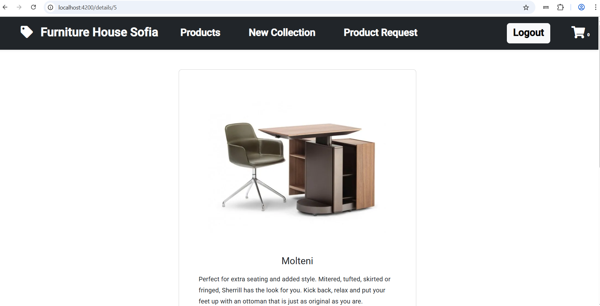

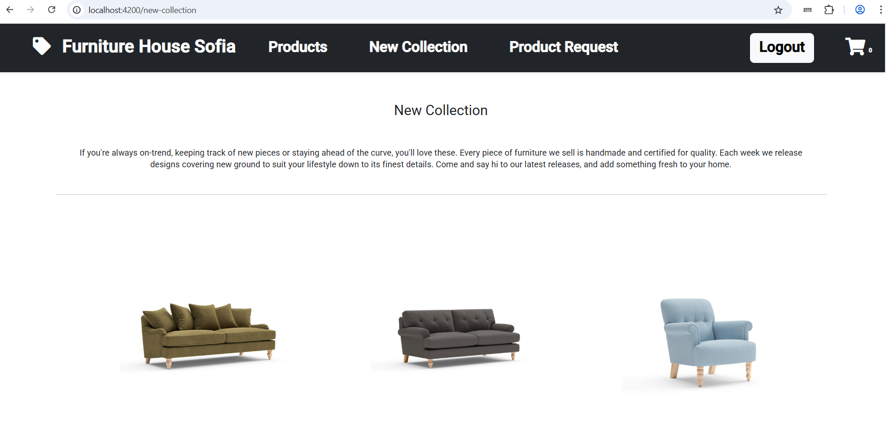

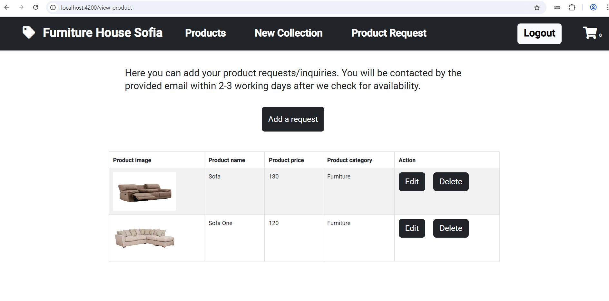

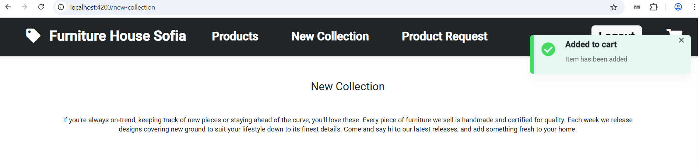

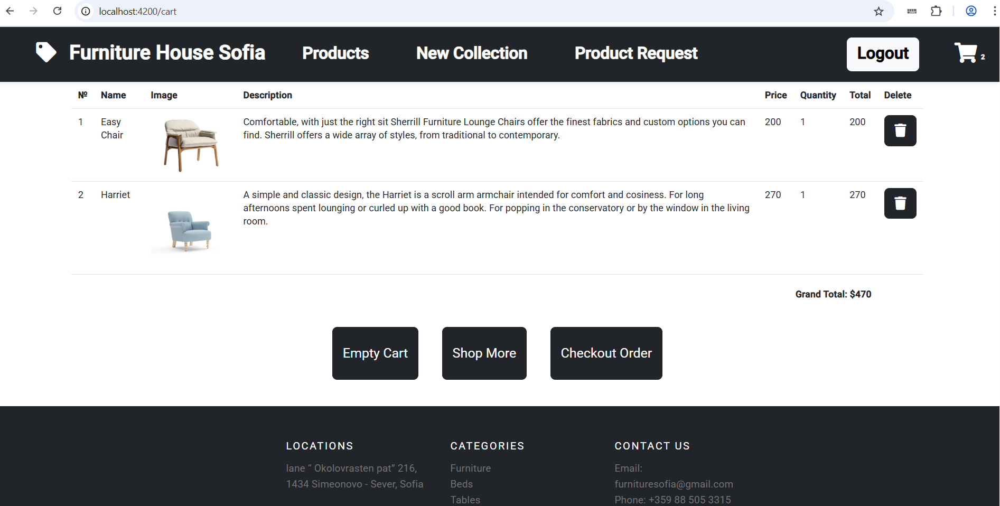

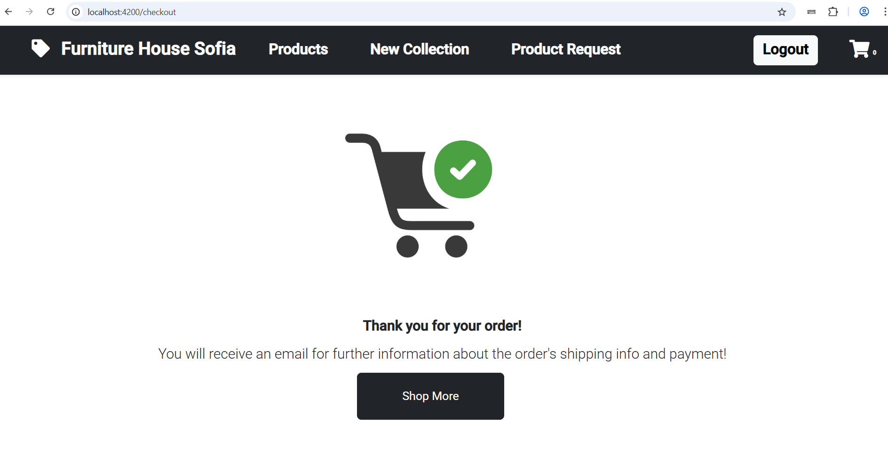

